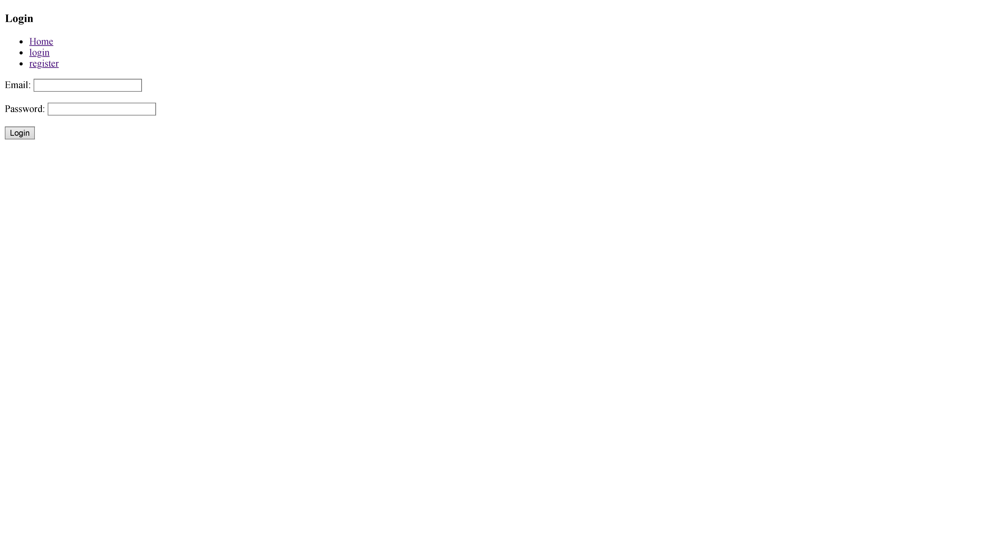
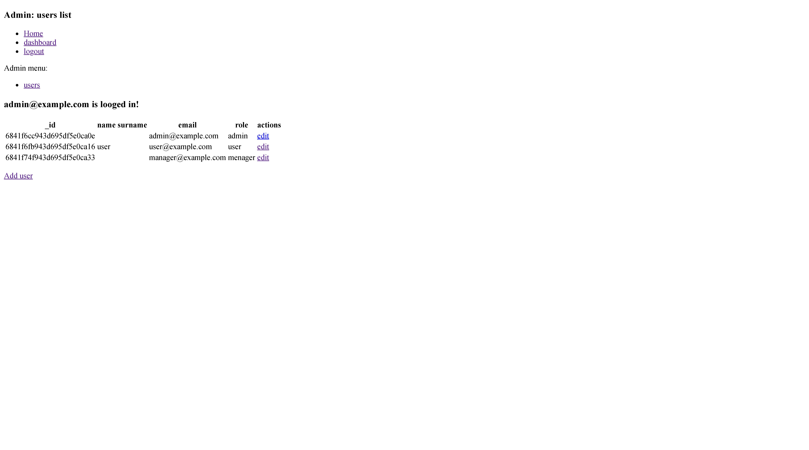
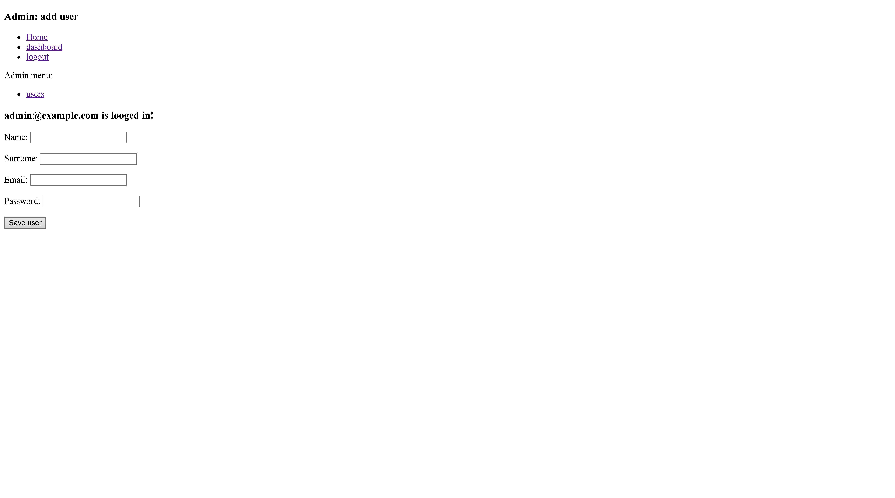

# 📘 User Management Web Application

A lightweight user management web app built with **Node.js**, **MongoDB**, and **EJS**, supporting multiple roles: **admin**, **manager**, and **user**. It uses Passport.js for authentication and an ACL system for fine-grained role-based access control.

---

## 🎯 Key Features

✅ Role-based user system (Admin, Manager, User)  
✅ Registration and login system using Passport.js  
✅ Admin dashboard for managing users  
✅ Manager role with limited access  
✅ Regular users can view and manage their own profile  
✅ Secure password hashing with bcrypt  
✅ Session handling with express-session  
✅ EJS templates for rendering UI  
✅ ACL middleware for permissions  
✅ MongoDB with Mongoose ORM  

---


## 🛠️ Technologies Used

- **Node.js**
- **MongoDB** + **Mongoose**
- **Passport.js** – authentication
- **bcrypt** – password hashing
- **ACL (Access Control List)** – role-based authorization
- **EJS** – template engine

---

## 🧱 Project Structure

```
├── controllers/
│   └── UsersController.js         # User-related logic
├── models/
│   └── user.model.js              # Mongoose User model
├── node_modules/
├── screenshots/                   # Screenshots or documentation images
├── utility/
│   ├── aclauth.js                 # ACL middleware
│   ├── auth.js                    # Passport strategies
│   ├── db.js                      # MongoDB connection
│   └── permissions.js             # Role permissions config
├── views/
│   ├── pages/
│   │   ├── admin/
│   │   │   ├── users_add.ejs
│   │   │   ├── users_edit.ejs
│   │   │   └── users.ejs
│   │   ├── dashboard.ejs
│   │   ├── index.ejs
│   │   ├── login.ejs
│   │   └── register.ejs
│   └── partials/
│       └── navbar.ejs
├── package.json
├── package-lock.json
└── server.js                      # Entry point
```

---

## 🚀 How to Run Locally

1. **Clone the repository:**

```bash
git clone https://github.com/yourusername/user-management-app.git
cd user-management-app
```

2. **Install dependencies:**

```bash
npm install
```

3. **Start MongoDB:**

Make sure MongoDB is running locally (e.g. via `mongod` or MongoDB Compass).

4. **Run the application:**

```bash
node server.js
```

5. **Visit in your browser:**

```
http://localhost:3000
```

---

## 📸 Screenshots

### 🏠 Home Page


### 🔐 Login Page


### 📝 Register Page


### Dashboard


### 🛠️ Admin Panel




## 🔑 Authentication & Authorization

* **Passport.js** handles user login and session
* **ACL** controls role-based permissions

| Role    | Permissions                              |
| ------- | ---------------------------------------- |
| Admin   | Full access to user management           |
| Manager | Can view users, limited edit access      |
| User    | Can view and edit only their own profile |

Middleware:

* `utility/auth.js` – Passport strategies
* `utility/aclauth.js` – ACL middleware
* `utility/permissions.js` – Role definitions

---

## 📄 Views (EJS Templates)

EJS templates are organized in `views/pages/`:

* `login.ejs` – login form
* `register.ejs` – registration form
* `dashboard.ejs` – user dashboard
* `index.ejs` – main index page
* `admin/users.ejs` – user list for admin
* `admin/users_add.ejs` – create user
* `admin/users_edit.ejs` – edit user
* `partials/navbar.ejs` – shared navigation bar

---

## ✅ TODO

* [ ] Form validation
* [ ] Pagination on user list
* [ ] User password change option
* [ ] User profile settings page

---

## 👨‍💻 Author

Created by **Jarosław Baumgart**

---

## 📜 License

Released under the **MIT License**

---

## 📬 Contact

* **GitHub:** [Jaroslaw-Baumgart](https://github.com/Jaroslaw-Baumgart)
* **Email:** [jaroslawbaumgart@gmail.com](mailto:jaroslawbaumgart@gmail.com)
